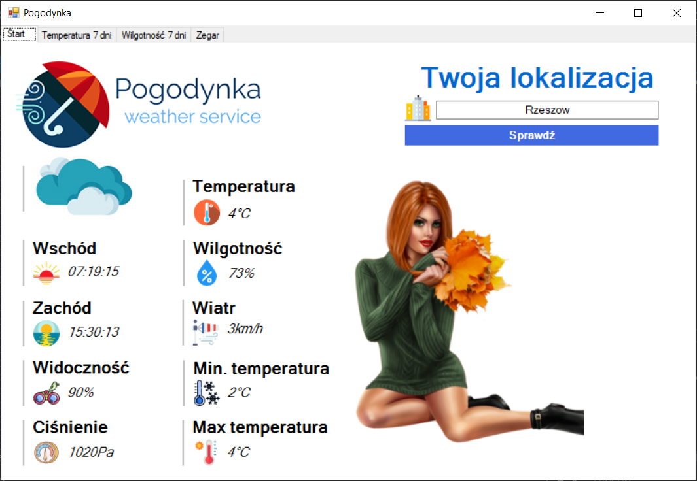
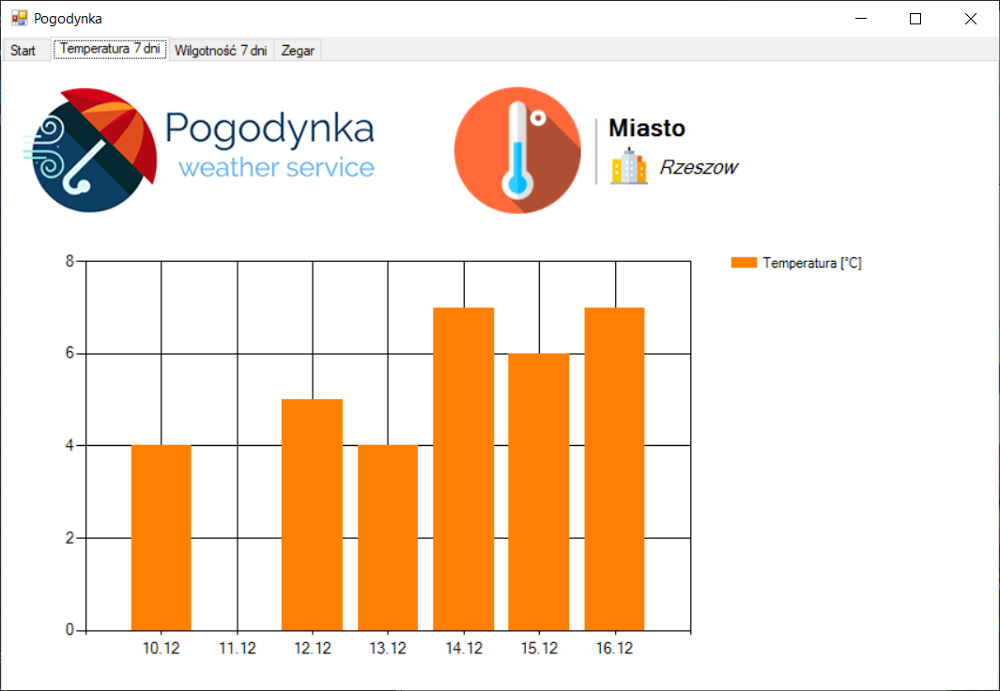
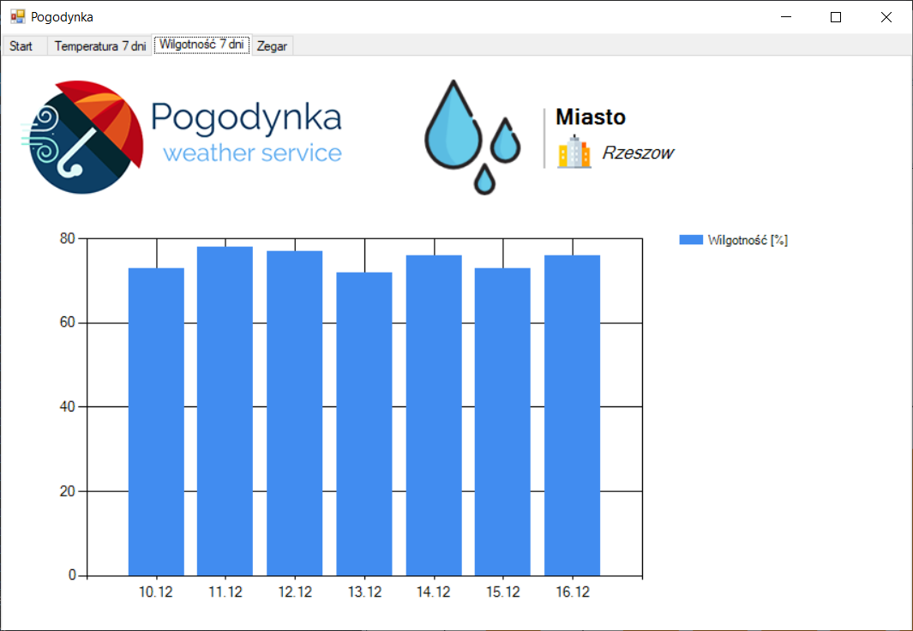
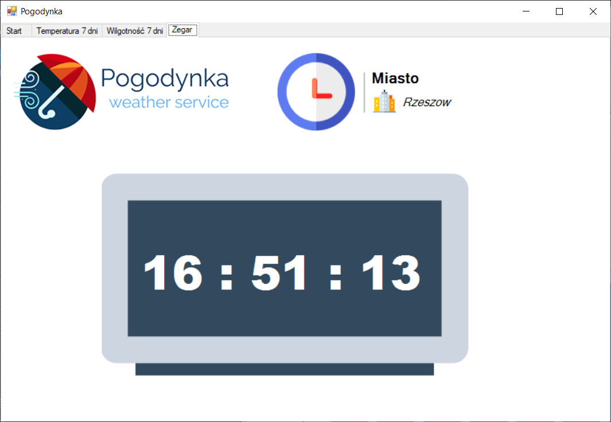
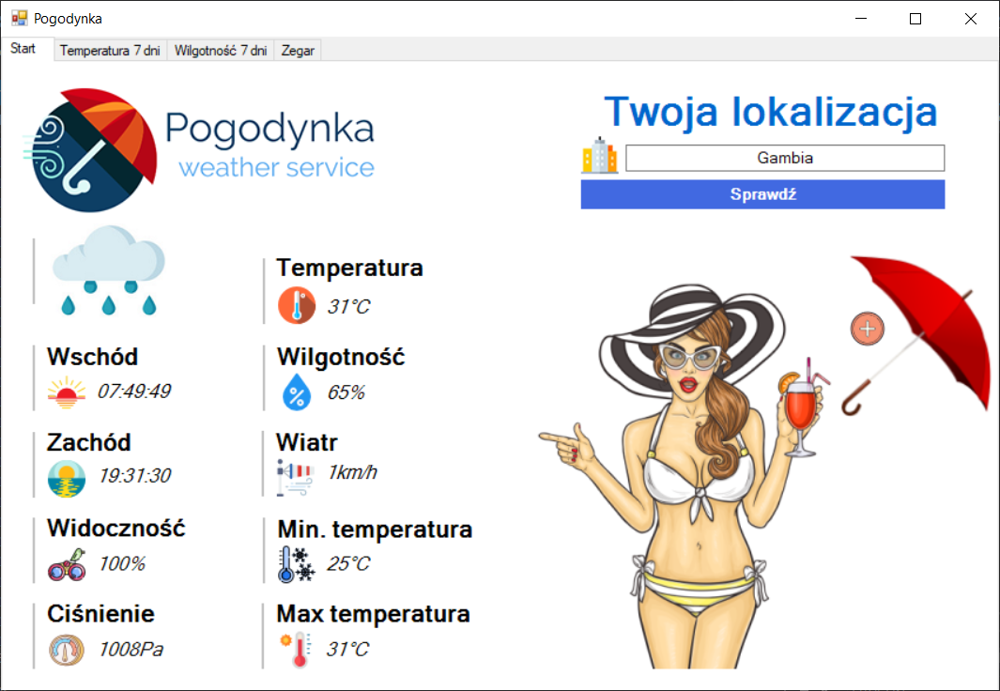
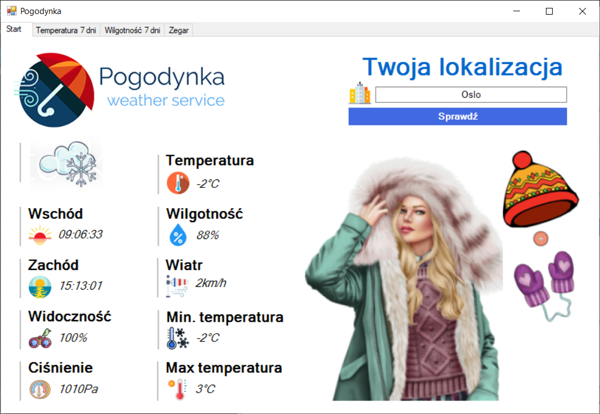

# Pogodynka - dokumentacja projektowa
##  Temat projektu i nazwa aplikacji
Pogodynka - to aplikacja desktopowa, która pozwala użytkownikowi monitorować pogodę oraz czas dla wybranych przez niego lokalizacji. Elementem wyróżniającym aplikację na tle konkurencji jest tytułowa wirtualna pogodynka, która w zależności od warunków atmosferycznych zmienia swój ubior. Dzięki temu użytkownik nie będzie miał problemu z ubiorem adekwatnym do pogody.

## Cel i opis projektu
Funkcjonalności aplikacji:
* Jako użytkownik chcę mieć możliwość sprawdzenia pogody na najbliższy czas.
* Jako użytkownik chce mieć możliwość sprawdzenia temperatury, ciśnienia, wilgotności, wschódu słońca, zachódu słońca, strefy czasowej, populacji, opadów w mm, zachmurzenia, prędkości wiatru.
* Jako użytkownik chcę mieć możliwość wyboru kraju oraz miasta, abym mógł sprawdzić pogodę dla określonej lokalizacji.
* Jako użytkownik chcę mieć możliwość wyświetlenia mapy, aby sprawdzić dokładną lokalizację miasta.
* Jako użytkownik chcę mieć możliwość wyświetlenia w formie obrazków proponowanego ubioru dla danych warunków atmosferycznych.
* Jako użytkownik chcę mieć możliwość zapisu wybranych miast, aby łatwiej kontrolować pogodę.
* Jako użytkownik chcę mieć możliwość wyświetlenia wykresów dla wybranych parametrów pogodowych.
* Jako użytkownik chcę mieć możliwość wyświetlania godziny dla wybranej lokalizacji.

## Technologie
* API Win32
  * Aplikacja okienkowa w języku C++
* Weather API

## Wykonał:
- Paweł Fiołek
- Alan Biały
- Patryk Brzuchacz

## Przykładowe użycie aplikacji:

 

   

 
 

   

 
 

   

 
 

   

 
 

   

 
 

   

 
